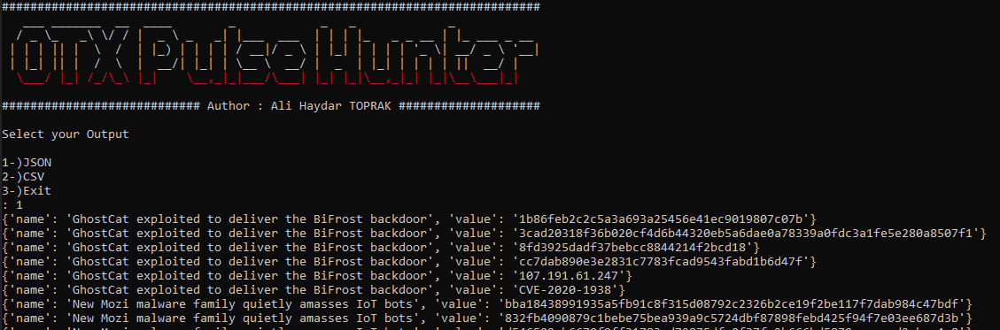

# OTX Pulse Hunter

### Description

These code snippets collect data published at "https://otx.alienvault.com/".
Separates the collected data according to categories and writes (json or csv) to the files.

### Requirements

- You must have python3 on your computer
- have requests and colorama modules
- You must get API KEY by sign up to "https://otx.alienvault.com/".

- API KEY should add to "Hunt.py"

### How to Works ?

- Clone or Download Repo
- Run "Hunt.py"

### Example Results

